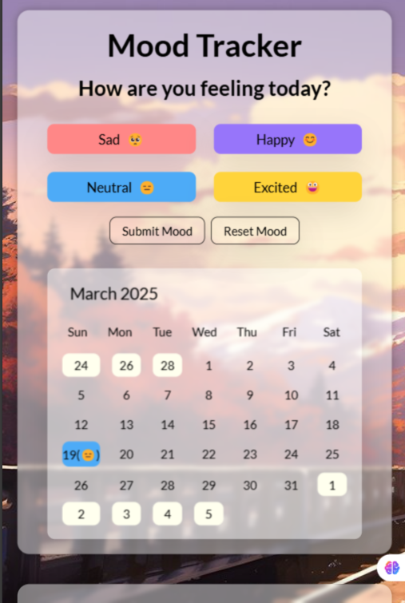

<h1>[Cohort] JS assignmnet 1</h1>

A mood tracker application

<h2>Working</h2>
<ul>
  <li>User's can picks a mood for the day.</li>
  <li>User's selected mood gets logged in LocalStorage.</li>
  <li>User's can view there mood timeline in calendar.</li>
</ul>

<h2>Screenshots</h2>

