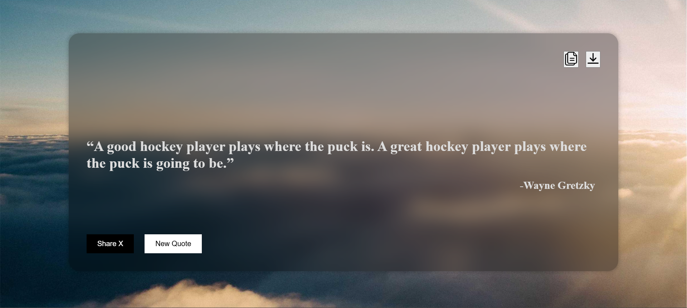

<h1>[Cohort] JS assignmnet 3</h1>

Quote of the Day application

<h2>Features</h2>
<ul>
  <li>Display the quote and author on the page.</li>
  <li>Background Image downloading</li>
  <li>Copy quote on cliboard</li>
  <li>Share quote on X.</li>
</ul>

<h2>Screenshots</h2>

