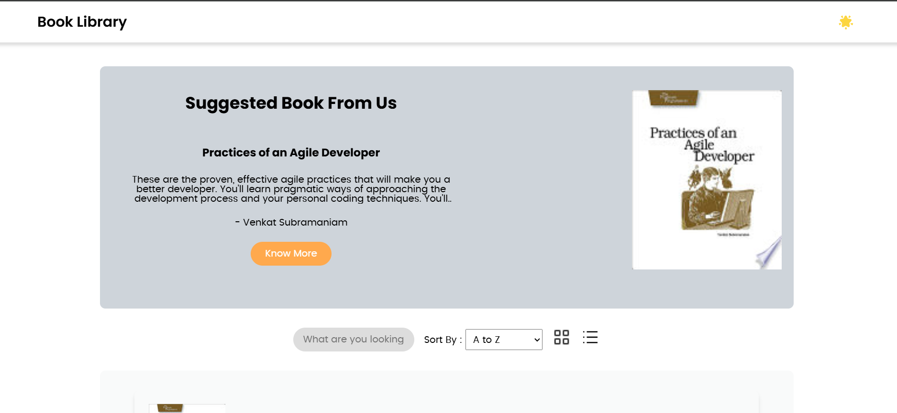
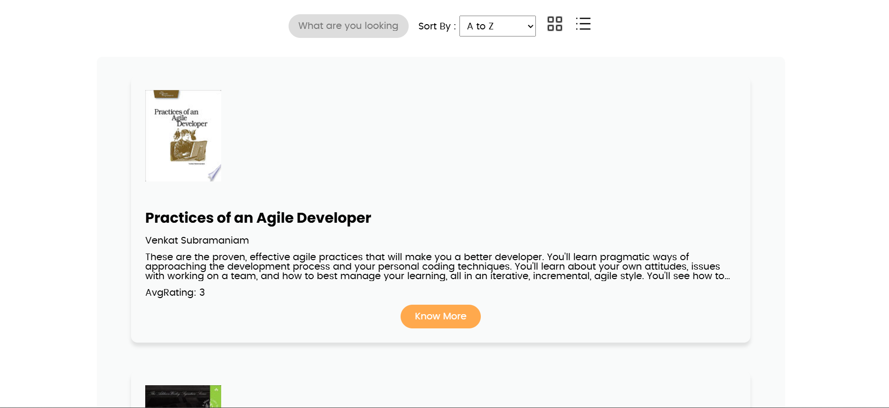
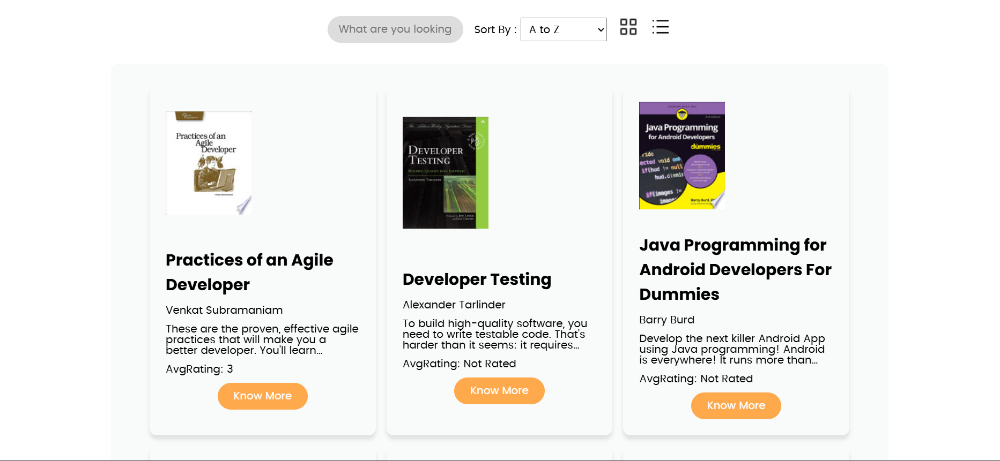
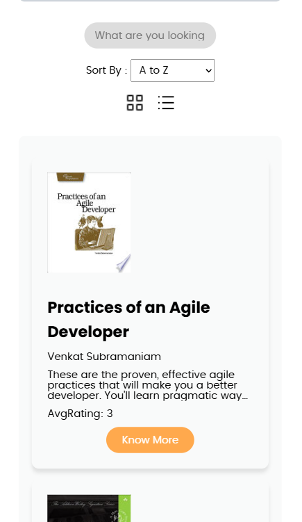

<h1>[Cohort] JS assignmnet 4</h1>

Book Library Application

<h2>Features</h2>
<ul>
  <li>Fetched books from the API and displayed them in a list/grid format.</li>
  <li>Added an option for users to switch between list and grid views.</li>
  <li>Displayed book details including title, author, description and thumbnail.</li>
  <li>Implemented a search bar to filter books by title or author.</li>
  <li>Added a sorting feature to order books alphabetically by title and by published date.</li>
  <li>Implemented pagination to fetch the next set of books when reaching the end of the page.</li>
  <li>Enabled book item clicks to open more details in a new tab using the provided <code>infoLink</code>.</li>
</ul>

<h2>Screenshots</h2>

